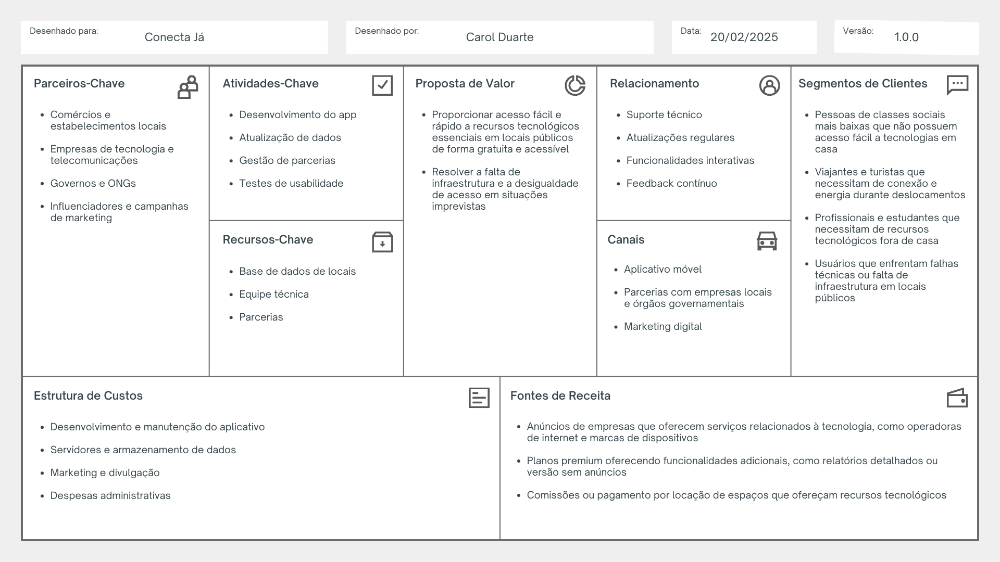

# DesignThinkingCanvas

*Escolha um problema do dia a dia e aplique os princípios do Design Thinking para propor uma solução. Responda às seguintes questões:*

**1. Qual o problema identificado?**

A dificuldade de acesso a recursos tecnológicos essenciais, como internet de qualidade ou dispositivos adequados, especialmente em situações de emergência ou necessidades imprevistas.

**2. Quem são os usuários impactados?**

- Pessoas de classes sociais mais baixas
- Viajantes e turistas
- Profissionais e estudantes que trabalham ou estudam fora de casa
- Usuários de tecnologia que enfrentam falhas técnicas ou falta de infraestrutura em locais públicos
- Pessoas em momentos imprevistos que precisam de acesso rápido à internet ou energia

**3. Quais insights você obteve sobre o problema?**

- A conectividade e a energia são essenciais para a maioria das atividades diárias, incluindo trabalho, comunicação e acesso a serviços.
- Em muitas localidades, pontos de acesso à internet e carregadores públicos são limitados ou mal sinalizados.
- A falta de acesso à tecnologia pode gerar desigualdade de oportunidades, afetando diretamente a educação, o desempenho no trabalho e a saúde. 
- A insegurança quanto à disponibilidade desses recursos gera frustração e impacta a produtividade e o bem-estar dos usuários.

**4. Quais possíveis soluções você imaginou?**

- **Desenvolvimento de um aplicativo de mapeamento interativo que indique locais públicos que disponibilizem acesso a tecnologias de forma gratuita, como Wi-Fi e pontos de carregamento de dispositivos. *[solução escolhida]***
- Parcerias com estabelecimentos comerciais e órgãos públicos para aumentar a oferta e visibilidade desses recursos.
- Criação de programas de empréstimo de dispositivos tecnológicos (como notebooks, celulares e Power Banks) para situações de emergência e para quem não pode adquirir ou manter um dispositivo próprio.

**5. Como você testaria a melhor solução?**

- **Prototipagem:** Criar um protótipo funcional do aplicativo, com mapeamento básico de locais em uma cidade ou região específica.
- **Testes com Usuários:** Realizar grupos focais e entrevistas com usuários em situações reais de uso, como viajantes ou pessoas em locais públicos, para entender a experiência.
- **Análise de Dados:** Coletar feedback sobre a usabilidade, precisão dos dados e a efetividade do recurso, ajustando o mapa conforme as necessidades.
- **Iteração:** Aprimorar as funcionalidades do app com base nos dados coletados e realizar novos testes em diferentes contextos.

*Utilize o Business Model Canvas para estruturar uma ideia de negócio baseada na solução proposta:*

